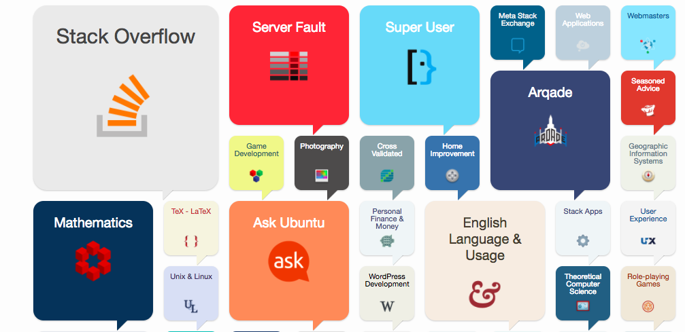
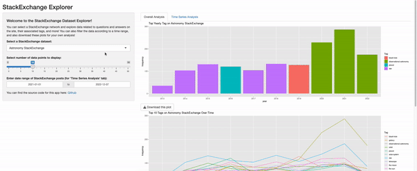
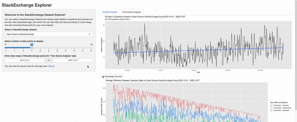

# Stack-Overflow-Analysis
 
This is a project designed to explore and visualize data from the [Stack Exchange Data Explorer](https://data.stackexchange.com/) website, in an [interactive RShiny applet](https://awesomecosmos.shinyapps.io/stack-overflow-analysis/).



## Table of Contents
  * [Motivation](#motivation)
  * [The Data](#the-data)
  * [The Code](#the-code)
  * [Demo of App!](#demo)
  * [You Want To Contribute?](#you-want-to-contribute)

## Motivation
From [Wikipedia](https://en.wikipedia.org/wiki/Stack_Exchange):

> Stack Exchange is a network of question-and-answer websites on topics in diverse fields, each site covering a specific topic, where questions, answers, and users are subject to a reputation award process. The reputation system allows the sites to be self-moderating.

As a data scientist, I code often, and am learning new technologies constantly. Sometimes I get stuck and refer to StackOverflow to learn from the community. The Stack Exchange network has quickly become my most-consulted website for help with learning new technologies, theories, methodologies, and more. I became interested in learning more about the network and the areas of expertise contributed to by the community, and naturally wrote some code to analyze this data.

## The Data
The datasets used in this analysis were downloaded from the [Stack Exchange Data Explorer](https://data.stackexchange.com/) website using the following SQL query:

```SELECT * FROM Posts;```

and downloaded as CSV files. I downloaded datasets for a few Stack Exchange network websites I visit often, such as the Astronomy, Data Science, Academia, etc. networks. Note that these are static datasets that were last downloaded on Dec 7, 2022.

## The Code
To view and explore the datasets, I created an [app](https://awesomecosmos.shinyapps.io/stack-overflow-analysis/) in R using the Shiny framework. If you want to run this app too, follow these instructions:

1. Clone this repo.
2. Have R and RStudio installed.
3. Click on the ```Stack-Overflow-Analysis.Rproj``` file. This should open RStudio with all files in this repository already loaded.
4. Run the file ```app.R```. Enjoy!

## Demo

You can change the selected dataset, and number of displayed data points, like so:



On the 'Time Series' tab, you can change the time range to view the overall trends for the selected dataset over a longer or shorter period of time.



You can also download plots for your own analysis using the 'Download plot' buttons below each plot! This saves the plots as a png image.

## You Want To Contribute?
Excellent! Some ways you could contribute:
- download more datasets from [Stack Exchange Data Explorer](https://data.stackexchange.com/) to use for this app
- create an issue for a feature you want to see
- create an issue for any type of analysis you want to see here
- etc!
